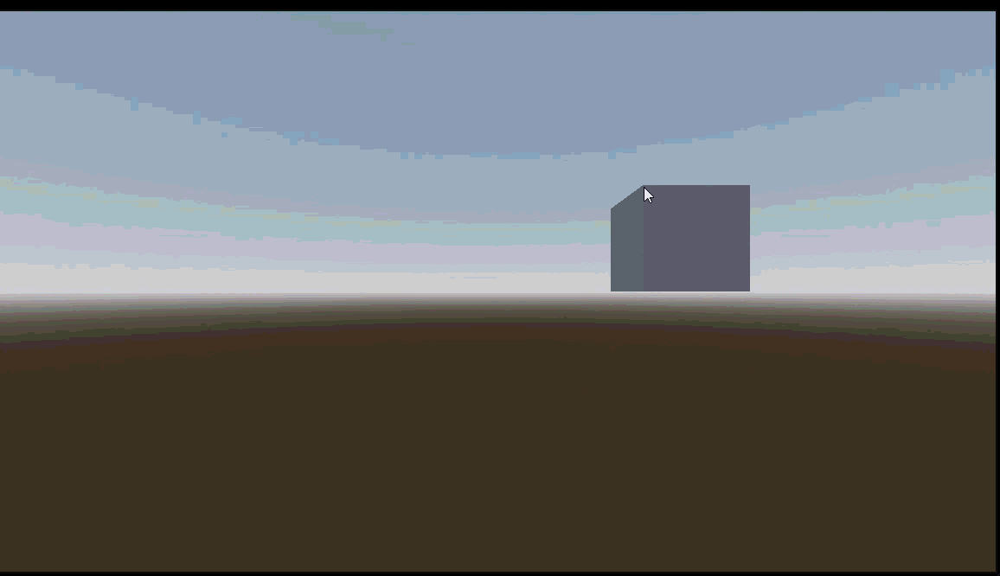

# Render Quality of GIFs

Render quality of GIFs is set to low to keep repo size in check.

---

## Camera System

**Responsibilities:**

- Input handling (tap vs drag)
- Zoom control (wheel + pinch)
- Camera modes: MOVE_XZ, MOVE_Y, ROTATE
- Signal-based mode switching
- Raycast-based click interaction

**Signals:**

- `SignalManeger.request_camera_mode(mode)`
- `SignalManeger.mouse_interact(hit, button)`

**Key scripts:**

- `camera_controller.gd`

---

## Grid Placement System

**Responsibilities:**

- Place units/blocks on a grid using mouse interaction
- Remove units/blocks from the grid
- Enforce build rules (which faces are valid for placement)
- Maintain spatial dictionary (`Vector3i` → `BaseUnit`) for fast lookup
- Automatically link neighboring units for each placed block
- Support multiple unit types via `PackedScene`

**Signals:**

- `SignalManeger.mouse_interact(hit, button)` — triggers placement/removal

**Key scripts:**

- `game_maneger.gd` — handles placement, removal, neighbor linking, grid mapping
- `base_unit.gd` — defines unit size, build faces, neighbors, inventory, and processing logic

---
